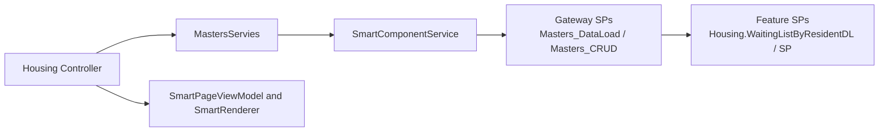

# SmartFoundation

SmartFoundation is an internal ASP.NET Core 8 MVC solution with a mixed architecture: some areas follow newer service patterns, while the most reliable implementation style today comes from the Housing module.

For developers and AI agents, the safest baseline is `SmartFoundation.Mvc/Controllers/Housing/WaitingList/HousingController.WaitingListByResident.cs`.

## Current Reality

- Real app entrypoint: `SmartFoundation.Mvc/Program.cs`
- Root `Program.cs` is stale and should not be treated as runtime code
- `SmartFoundation.Mvc` is the actual web app and composition root
- `SmartFoundation.Database` is a snapshot/reference only, not the source of truth
- `AGENTS.md` is the main operating guide for contributors and coding agents

## Solution Structure

- `SmartFoundation.Mvc` - MVC app, routing, controllers, session, composition root
- `SmartFoundation.Application` - application services, `ProcedureMapper`, gateway service logic
- `SmartFoundation.DataEngine` - Dapper execution layer via `SmartRequest` and `SmartResponse`
- `SmartFoundation.UI` - reusable ViewComponents and page/view models
- `SmartFoundation.Application.Tests` - current xUnit test project
- `SmartFoundation.Database` - database snapshot/reference project
- `docs` - supporting notes and migration-era documentation; use carefully

## Runtime Flow

The most important active flow in this repository is the Housing-style page pattern.



In practical terms:

- MVC controllers prepare context and parameters
- `MastersServies` calls gateway procedures
- gateway procedures route by `@pageName_` and `@ActionType`
- downstream feature procedures contain business logic and validations
- controllers build UI models server-side and render through `SmartRenderer`

## Housing Baseline

If you need one file to understand how this project really works, start here:

- `SmartFoundation.Mvc/Controllers/Housing/WaitingList/HousingController.WaitingListByResident.cs`

That flow shows the active conventions for:

- session-backed page context via `HousingController.Base`
- `DataSet` and `DataTable`-driven page assembly
- permission handling from the first result table
- DDL loading through `CrudController`
- CRUD posting through the generic `/crud/*` contract
- server-built `FormConfig`, `SmartTableDsModel`, and `SmartPageViewModel`
- gateway stored procedure routing through `Masters_DataLoad` and `Masters_CRUD`

Supporting reference files:

- `SmartFoundation.Mvc/Controllers/Housing/HousingController.Base.cs`
- `SmartFoundation.Mvc/Controllers/CrudController.cs`
- `SmartFoundation.Application/Services/MastersServies.cs`
- `SmartFoundation.UI/ViewModels/SmartPage/SmartPageViewModel.cs`
- `SmartFoundation.UI/ViewComponents/SmartRenderer/SmartRendererViewComponent.cs`

## Procedure Routing Principles

This repository uses gateway stored procedures for many Housing-style flows.

- Application code should reach entry procedures such as `dbo.Masters_DataLoad` and `dbo.Masters_CRUD`
- Those gateway procedures route to feature procedures by `@pageName_` and sometimes `@ActionType`
- Downstream procedures hold business logic and validations
- `ProcedureMapper` should map entry procedures exposed to the app layer, not every downstream business procedure

Shared database-side patterns:

- `Masters_DataLoad` returns `permissionTypeName_E` first, then page-specific resultsets
- Housing `DL` procedures usually return main feature data first, then DDL/lookup resultsets
- Housing `SP` procedures usually follow a shared write template with transaction guards, `TRY/CATCH`, business validations, audit logging, and `IsSuccessful` / `Message_` results
- `Masters_CRUD` handles permission checks before downstream writes and may trigger notifications through `dbo.Notifications_Create`

Canonical example:

- `dbo.Masters_DataLoad` -> `[Housing].[WaitingListByResidentDL]`
- `dbo.Masters_CRUD` -> `[Housing].[WaitingListByResidentSP]`

Relevant files:

- `SmartFoundation.Application/Mapping/ProcedureMapper.cs`
- `SmartFoundation.Database/dbo/Stored Procedures/Masters_DataLoad.sql`
- `SmartFoundation.Database/dbo/Stored Procedures/Masters_CRUD.sql`
- `SmartFoundation.Database/Housing/Stored Procedures/WaitingListByResidentDL.sql`
- `SmartFoundation.Database/Housing/Stored Procedures/WaitingListByResidentSP.sql`

## Database Warning

`SmartFoundation.Database` is a snapshot/reference only.

- It is not guaranteed current
- It must not be treated as the source of truth
- It is useful for understanding intent, naming, and routing

When database behavior matters, verify against active runtime code first:

- `SmartFoundation.Application/Mapping/ProcedureMapper.cs`
- `SmartFoundation.Application/Services/MastersServies.cs`
- `SmartFoundation.DataEngine/Core/Services/SmartComponentService.cs`
- current MVC callers in `SmartFoundation.Mvc`

## Quick Start

Clone the repository and restore dependencies:

```powershell
git clone <repository-url>
cd SmartFoundation
dotnet restore SmartFoundation.sln
```

Build the solution:

```powershell
dotnet build SmartFoundation.sln
```

Run the MVC app:

```powershell
dotnet run --project SmartFoundation.Mvc/SmartFoundation.Mvc.csproj
```

The default route currently starts at the login page.

## Frontend Assets

Frontend tooling lives in `SmartFoundation.Mvc`.

Install packages:

```powershell
npm install --prefix SmartFoundation.Mvc
```

Build Tailwind once:

```powershell
npm --prefix SmartFoundation.Mvc run tw:build
```

Watch Tailwind during development:

```powershell
npm --prefix SmartFoundation.Mvc run tw:watch
```

Key files:

- input CSS: `SmartFoundation.Mvc/wwwroot/css/input.css`
- output CSS: `SmartFoundation.Mvc/wwwroot/css/site.css`
- config: `SmartFoundation.Mvc/tailwind.config.js`

## Testing

Current automated tests live in `SmartFoundation.Application.Tests`.

Run all tests:

```powershell
dotnet test SmartFoundation.Application.Tests/SmartFoundation.Application.Tests.csproj
```

List tests:

```powershell
dotnet test SmartFoundation.Application.Tests/SmartFoundation.Application.Tests.csproj --list-tests
```

Run one test class:

```powershell
dotnet test SmartFoundation.Application.Tests/SmartFoundation.Application.Tests.csproj --filter "FullyQualifiedName~EmployeeServiceTests"
```

Run one exact test:

```powershell
dotnet test SmartFoundation.Application.Tests/SmartFoundation.Application.Tests.csproj --filter "FullyQualifiedName=SmartFoundation.Application.Tests.Services.EmployeeServiceTests.GetEmployeeList_WithValidParams_ReturnsSuccessJson"
```

Collect coverage:

```powershell
dotnet test SmartFoundation.Application.Tests/SmartFoundation.Application.Tests.csproj --collect:"XPlat Code Coverage"
```

Notes:

- There is no MVC test project today
- Full solution build includes `SmartFoundation.Database.sqlproj`, which may require SQL project tooling locally

## Working Conventions

Important active conventions in this repository:

- Housing-style pages often use `MastersServies` and `DataSet`/`DataTable`
- `CrudController` maps `p01..p50` form fields to `parameter_01..parameter_50`
- hidden fields like `pageName_`, `ActionType`, `idaraID`, `entrydata`, and `hostname` are part of the runtime contract
- `SmartRenderer` is the main thin-view rendering path for complex pages
- active code should be trusted over older migration-era docs

Do not casually refactor these away unless the task explicitly requires it.

## Developer And Agent Guidance

Start with these files before making changes:

- `AGENTS.md`
- `.github/copilot-instructions.md`
- `SmartFoundation.Mvc/Controllers/Housing/WaitingList/HousingController.WaitingListByResident.cs`
- `SmartFoundation.Mvc/Controllers/Housing/HousingController.Base.cs`
- `SmartFoundation.Mvc/Controllers/CrudController.cs`

Use `AGENTS.md` as the main working guide for current patterns and repo rules.

## Useful Docs

- `AGENTS.md` - current repo operating guide for developers and AI agents
- `.github/copilot-instructions.md` - supporting coding and markdown rules
- `docs/Unit_Testing_For_Beginners.md` - test onboarding notes
- `docs/dual-date-picker.md` - component-specific reference

## Summary

This repository is best understood as an active MVC application with a strong Housing-era implementation pattern.

If you are adding or updating a page that looks like Housing, copy the `WaitingListByResident` style first and preserve the gateway SP, CRUD, and `DataSet` conventions unless the task explicitly changes that architecture.
