# نظام التذاكر متعدد الأقسام - تحليل سير العمل

---

## 1. طبقات البنية المعمارية

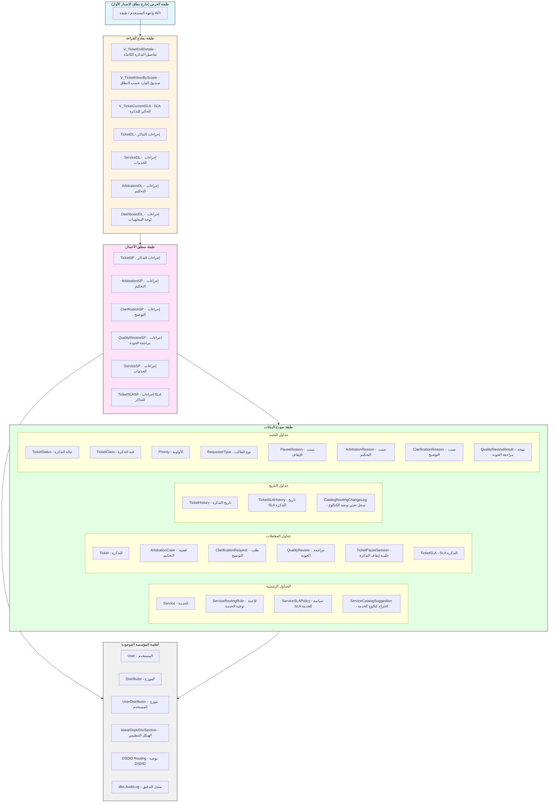

---

## 2. تبعيات المواصفات

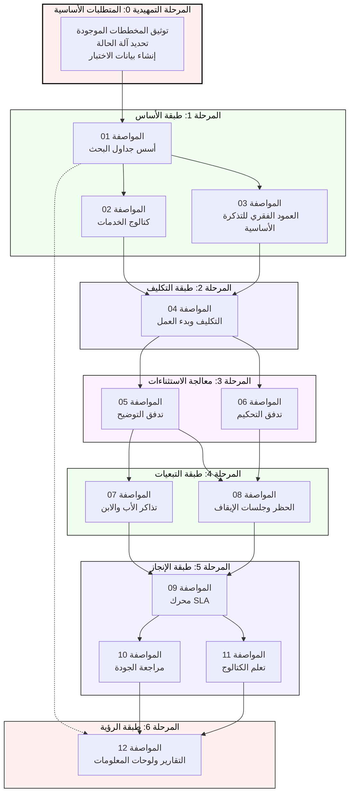

---

## 3. ترتيب إنشاء الجداول

```mermaid
graph LR
    subgraph P1["المرحلة 1: جداول البحث (المواصفة 01)"]
        L1[TicketStatus - حالة التذكرة]
        L2[TicketClass - فئة التذكرة]
        L3[Priority - الأولوية]
        L4[RequesterType - نوع الطالب]
        L5[PauseReason - سبب الإيقاف]
        L6[ArbitrationReason - سبب التحكيم]
        L7[ClarificationReason - سبب التوضيح]
        L8[QualityReviewResult - نتيجة مراجعة الجودة]
    end

    subgraph P2["المرحلة 2: الجداول الرئيسية (المواصفة 02)"]
        M1[Service - الخدمة]
        M2[ServiceRoutingRule - قاعدة التوجيه]
        M3[ServiceSLAPolicy - سياسة SLA]
        M4[ServiceCatalogSuggestion - اقتراح الكتالوج]
    end

    subgraph P3["المرحلة 3: جداول المعاملات"]
        T1[Ticket - التذكرة<br/>المواصفة 03]
        T5[ClarificationRequest - طلب التوضيح<br/>المواصفة 05]
        T2[ArbitrationCase - قضية التحكيم<br/>المواصفة 06]
        T6[QualityReview - مراجعة الجودة<br/>المواصفة 10]
        T3[TicketPauseSession - جلسة الإيقاف<br/>المواصفة 08]
        T4[TicketSLA - SLA التذكرة<br/>المواصفة 09]
        T7[CatalogRoutingChangeLog - سجل التوجيه<br/>المواصفة 11]
    end

    subgraph P4["المرحلة 4: جداول التاريخ"]
        H1[TicketHistory - تاريخ التذكرة<br/>المواصفة 03]
        H2[TicketSLAHistory - تاريخ SLA<br/>المواصفة 09]
        H3[CatalogRoutingChangeLog - سجل التوجيه<br/>المواصفة 11]
    end

    P1 --> P2
    P2 --> P3
    P3 --> P4

    classDef p1Font fill:#e1f5ff,stroke:#000000,stroke-width:1px,color:#000000;
    class P1 p1Font;

    classDef p2Font fill:#fff4e1,stroke:#000000,stroke-width:1px,color:#000000;
    class P2 p2Font;

    classDef p3Font fill:#ffe1f5,stroke:#000000,stroke-width:1px,color:#000000;
    class P3 p3Font;

    classDef p4Font fill:#e1ffe1,stroke:#000000,stroke-width:1px,color:#000000;
    class P4 p4Font;
```

---

## 4. آلة حالة التذكرة (مستنتجة - تحتاج للتعريف)

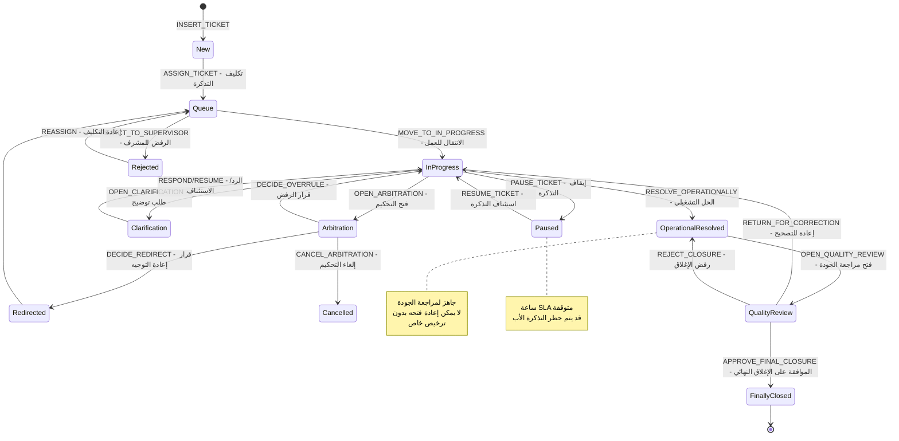

---

## 5. تبعيات الإجراءات المخزنة

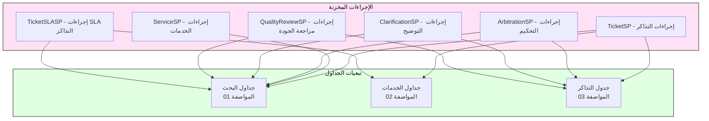

---

## 6. تدفق تنفيذ المراحل

```mermaid
graph LR
    subgraph M0["المرحلة التمهيدية 0: المتطلبات الأساسية"]
        TASK0[توثيق المخططات<br/>تحديد آلة الحالة<br/>إنشاء بيانات الاختبار]
    end

    subgraph M1["المرحلة 1: الأساس"]
        TASK1[إنشاء جداول البحث<br/>بناء كتالوج الخدمات<br/>إنشاء التذكرة الأساسية]
        CHECK1[نقطة التحقق:<br/>يمكن إنشاء تذكرة؟]
    end

    subgraph M2["المرحلة 2: التكليف"]
        TASK2[معالجة الطابور<br/>تكليف المستخدم<br/>بدء العمل]
        CHECK2[نقطة التحقق:<br/>يمكن التكليف وبدء العمل؟]
    end

    subgraph M3["المرحلة 3: الاستثناءات"]
        TASK3[تدفق التوضيح<br/>تدفق التحكيم<br/>نزاعات النطاق]
        CHECK3[نقطة التحقق:<br/>يمكن معالجة الاستثناءات؟]
    end

    subgraph M4["المرحلة 4: التبعيات"]
        TASK4[تذاكر الأب والابن<br/>منطق الحظر<br/>جلسات الإيقاف]
        CHECK4[نقطة التحقق:<br/>يمكن نمذجة التبعيات؟]
    end

    subgraph M5["المرحلة 5: الإنجاز"]
        TASK5[محرك SLA<br/>مراجعة الجودة<br/>تعلم الكتالوج]
        CHECK5[نقطة التحقق:<br/>الدورة الكاملة تعمل؟]
    end

    subgraph M6["المرحلة 6: الرؤية"]
        TASK6[طرق عرض لوحة المعلومات<br/>إجراءات التقارير<br/>مقاييس القيادة]
        CHECK6[نقطة التحقق:<br/>النظام الكامل جاهز؟]
    end

    TASK0 --> TASK1 --> CHECK1
    CHECK1 --> TASK2 --> CHECK2
    CHECK2 --> TASK3 --> CHECK3
    CHECK3 --> TASK4 --> CHECK4
    CHECK4 --> TASK5 --> CHECK5
    CHECK5 --> TASK6 --> CHECK6

    classDef task0Font fill:#fff0f0,stroke:#000000,stroke-width:1px,color:#000000;
    class TASK0 task0Font;

    classDef task1Font fill:#f0fff0,stroke:#000000,stroke-width:1px,color:#000000;
    class TASK1 task1Font;

    classDef task2Font fill:#f0f0ff,stroke:#000000,stroke-width:1px,color:#000000;
    class TASK2 task2Font;

    classDef task3Font fill:#fff0ff,stroke:#000000,stroke-width:1px,color:#000000;
    class TASK3 task3Font;

    classDef task4Font fill:#f0fff0,stroke:#000000,stroke-width:1px,color:#000000;
    class TASK4 task4Font;

    classDef task5Font fill:#f0f0ff,stroke:#000000,stroke-width:1px,color:#000000;
    class TASK5 task5Font;

    classDef task6Font fill:#fff0f0,stroke:#000000,stroke-width:1px,color:#000000;
    class TASK6 task6Font;

    classDef checkFont fill:#ffd700,stroke:#000000,stroke-width:2px,color:#000000;
    class CHECK1,CHECK2,CHECK3,CHECK4,CHECK5,CHECK6 checkFont;
```

---

## 7. ملخص الفجوات الحرجة

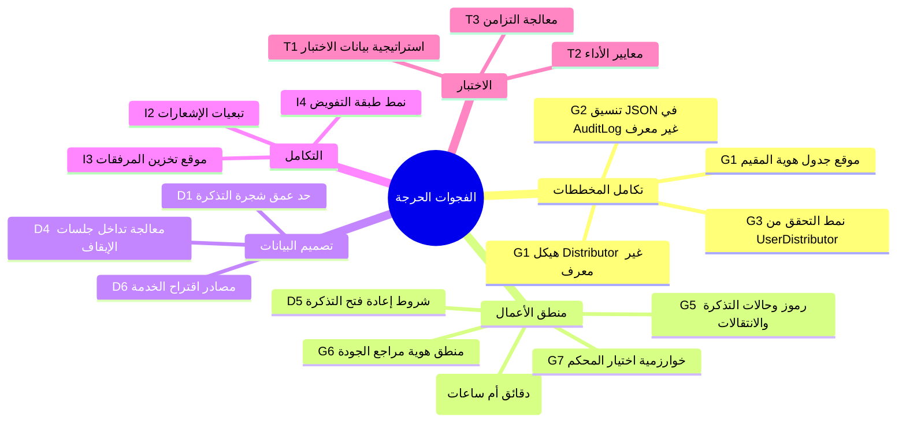

---

## 8. مصفوفة التنفيذ حسب الأولوية

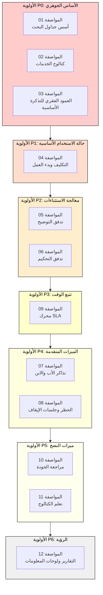

---

## 9. تدفق البيانات: تذكرة بخدمة معروفة

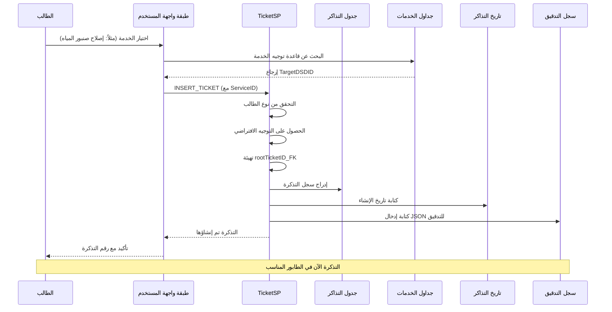

---

## 10. تدفق البيانات: قضية التحكيم

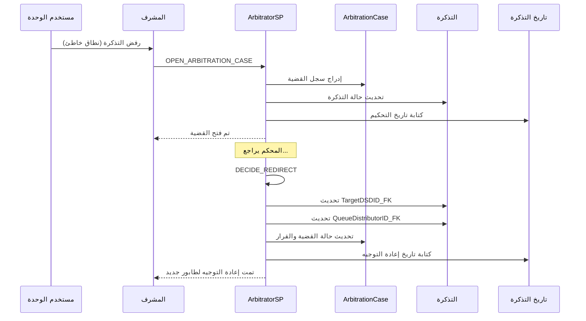

---

## 11. تدفق حظر الأب والابن

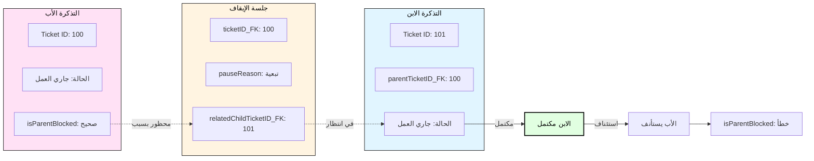

---

## 12: مرجع سريع - مخرجات المواصفات

```mermaid
graph TB
    subgraph Legend["الدليل"]
        LDB[مهام قاعدة البيانات]
        LSP[الإجراءات المخزنة]
        LV[طرق العرض / إجراءات القراءة]
        LUI[مهام واجهة المستخدم]
    end

    subgraph Spec01["المواصفة 01: أسس جداول البحث"]
        S01DB[8 جداول بحث<br/>برامج تشغيل البيانات الأولية]
        S01T[اختبارات التفرد]
    end

    subgraph Spec02["المواصفة 02: كتالوج الخدمات"]
        S02DB[4 جداول رئيسية]
        S02SP[ServiceSP - 8 إجراءات]
        S02R[V_ServiceFullDefinition<br/>ServiceDL]
        S02UI[5 شاشات إدارة]
    end

    subgraph Spec03["المواصفة 03: التذكرة الأساسية"]
        S03DB[Ticket + TicketHistory]
        S03SP[TicketSP - INSERT_TICKET]
        S03R[V_TicketFullDetails<br/>V_TicketLastAction<br/>TicketDL]
        S03UI[الإنشاء + التفاصيل + القائمة]
    end

    subgraph Spec04["المواصفة 04: التكليف"]
        S04SP[TicketSP - 4 إجراءات]
        S04R[ملحقات الطابور]
        S04UI[4 شاشات تكليف]
    end

    subgraph Spec05["المواصفة 05: التوضيح"]
        S05DB[ClarificationRequest]
        S05SP[ClarificationSP - 3 إجراءات]
        S05UI[شاشتا توضيح]
    end

    subgraph Spec06["المواصفة 06: التحكيم"]
        S06DB[ArbitrationCase]
        S06SP[ArbitrationSP - 4 إجراءات]
        S06R[ArbitrationDL]
        S06UI[شاشتا تحكيم]
    end

    subgraph Spec07["المواصفة 07: الأب والابن"]
        S07SP[TicketSP - CREATE_CHILD]
        S07R[ملحق تحميل الشجرة]
        S07UI[شاشتا أب وابن]
    end

    subgraph Spec08["المواصفة 08: الحظر"]
        S08DB[TicketPauseSession]
        S08SP[TicketSP - إجراءان]
        S08UI[3 شاشات إيقاف/استئناف]
    end

    subgraph Spec09["المواصفة 09: SLA"]
        S09DB[TicketSLA + History]
        S09SP[TicketSLASP]
        S09R[V_TicketCurrentSLA]
        S09UI[شارات SLA + القوائم]
    end

    subgraph Spec10["المواصفة 10: الجودة"]
        S10DB[QualityReview]
        S10SP[QualityReviewSP - 4 إجراءات]
        S10UI[3 شاشات جودة]
    end

    subgraph Spec11["المواصفة 11: التعلم"]
        S11DB[CatalogRoutingChangeLog]
        S11SP[ServiceSP - إجراءان]
        S11UI[3 شاشات تعلم]
    end

    subgraph Spec12["المواصفة 12: التقارير"]
        S12R[3 طرق عرض طابور<br/>DashboardDL]
        S12UI[4 شاشات لوحة معلومات]
    end

    classDef dbFont fill:#e1ffe1,stroke:#000000,stroke-width:1px,color:#000000;
    class LDB,S01DB,S03DB,S05DB,S06DB,S08DB,S09DB,S10DB,S11DB dbFont;

    classDef spFont fill:#ffe1f5,stroke:#000000,stroke-width:1px,color:#000000;
    class LSP,S02SP,S03SP,S04SP,S05SP,S06SP,S07SP,S08SP,S09SP,S10SP,S11SP spFont;

    classDef viewFont fill:#fff4e1,stroke:#000000,stroke-width:1px,color:#000000;
    class LV,S02R,S03R,S04R,S06R,S07R,S09R,S12R viewFont;

    classDef uiFont fill:#e1f5ff,stroke:#000000,stroke-width:1px,color:#000000;
    class LUI,S01T,S02UI,S03UI,S04UI,S05UI,S06UI,S07UI,S08UI,S09UI,S10UI,S11UI,S12UI uiFont;
```

---

---

## الملخص التنفيذي

### الأهداف غير القابلة للتفاوض

| الرمز | الهدف | السبب |
|-------|-------|-------|
| O1 | نظام تذاكر يعتمد على قاعدة البيانات أولاً | جميع عمليات الكتابة عبر الإجراءات المخزنة |
| O2 | دعم مصادر طلبات متعددة | المقيمون/المستفيدون والمستخدمون الداخليون |
| O3 | التوجيه الهرمي عبر الهيكل التنظيمي | DSDID هو مصدر الحقيقة للتوجيه |
| O4 | فصل المشاكل التشغيلية في تدفقات مميزة | توجيه خاطئ، معلومات ناقصة، تبعيات |
| O5 | إغلاق على مرحلتين مع التحقق من الجودة | إغلاق تشغيلي ← إغلاق نهائي/تحقق |
| O6 | سجل تدقيق كامل | كل تغيير ذي معنى يجب أن يكون قابلاً للتتبع |
| O7 | علاقات تذاكر الأب والابن مع منطق الحظر | أب واحد فقط، مرجع جذر التذكرة إلزامي |
| O8 | تتبع SLA مع سلوك الإيقاف/الاستئناف | ساعات SLA تتوقف أثناء نوافذ الحظر الصحيحة |
| O9 | كتالوج الخدمات مع إمكانية التعلم | طلبات "أخرى" يمكن أن تتطور لخدمات رسمية |
| O10 | IdaraID_FK في معظم الجداول | للتصفية، التقارير، لوحات المعلومات |

### الفجوات الحرجة التي تتطلب الحل

| الفجوة | الوصف | التأثير |
|---------|-------|---------|
| G1 | هياكل المخطط الموجودة غير معرفة | لا يمكن إنشاء مفاتيح خارجية |
| G2 | سجل التدقيق غير معرف | لا يمكن تنفيذ تسجيل JSON |
| G3 | نمط التحقق من UserDistributor غير محدد | لا يمكن التحقق من أهلية التكليف |
| G4 | وحدة وقت SLA غامضة | دقائق أم ساعات؟ |
| G5 | رموز حالة التذكرة غير معرفة | ضرورية لمنطق آلة الحالة |
| G6 | هوية مراجع الجودة غير معرفة | من يجري المراجعة؟ |
| G7 | منطق اختيار المحكم غير معرف | كيف يتم تحديد المحكم؟ |
| G8 | سير عمل الموافقة على التذكرة الابن غير معرف | آلية الموافقة غير محددة |

---

*تم إنشاؤه من تحليل plan.md*
*آخر تحديث: 2026-03-31*
